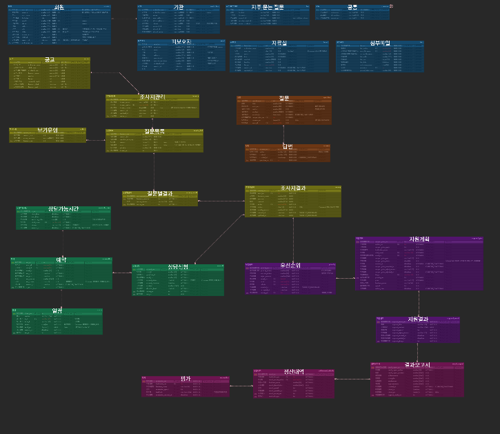
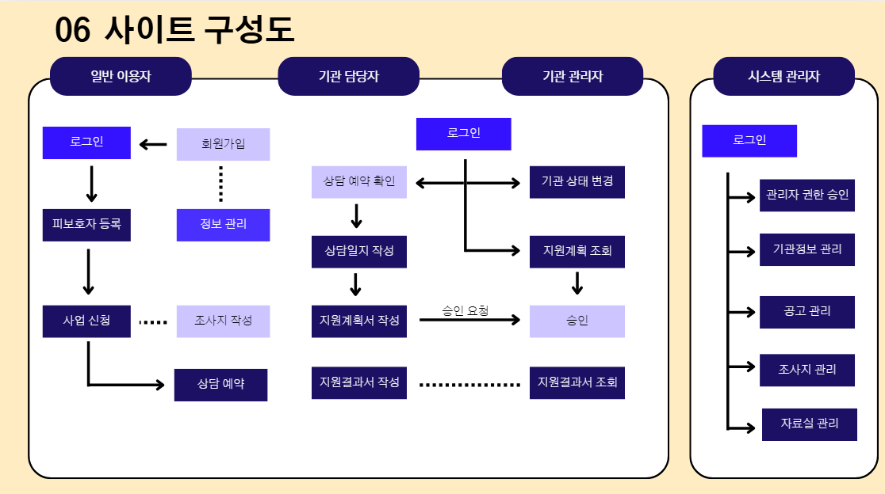

# 예담직업전문학교

# 프로젝트 제목

4강 1조 발달 장애인 대기 지원 프로그램

# 프로젝트 개요

발달 장애인들에게 가장 필요한 순간
적합한 도움을 줄 수
있는 시스템 구현

# 개발환경

분석 설계 : figma, ERD Cloud, Google Workspace
통합 개발 환경 : Visual Studio Code
형상관리 툴 : GitHub
데이터베이스 : MariaDB
배포 환경 : GitHub actions, NAVERCloud
프론트엔드 : Vue, PRIMEVUE, Pinia, HTML, CSS, JavaScript
백엔드 : Node, express

# 데이터 베이스 설계

# 사이트 구성도

# 프로젝트 팀 구성 및 역할

배진욱 : 조장, 기관 담당자, 기관 관리자, 업무처리 프로세스
박세민 : 부조장, 로그인, 소셜 로그인, 스케줄 예약, 상담관리
박희찬 : 개발환경 구축 및 관리, 조사지 관리, Q&A, 자료실
김현태 : GitHub 생성 및 관리, 마이페이지, 기관 상태 변경
김동우 : DB서버 구축 및 관리, 회원가입, 시스템 관리자

## Git 주소

**GitHub Repository:** [Git 주소](https://github.com/DevDisability-Assist/team-project.git)

# 데모 시연영상

**시연 영상:** [4강 1조 발달 장애인 대기 지원 프로그램](https://youtu.be/3tPxfIJvv7o)
